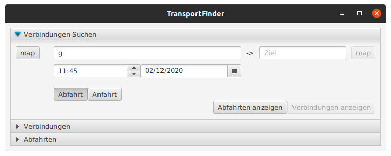
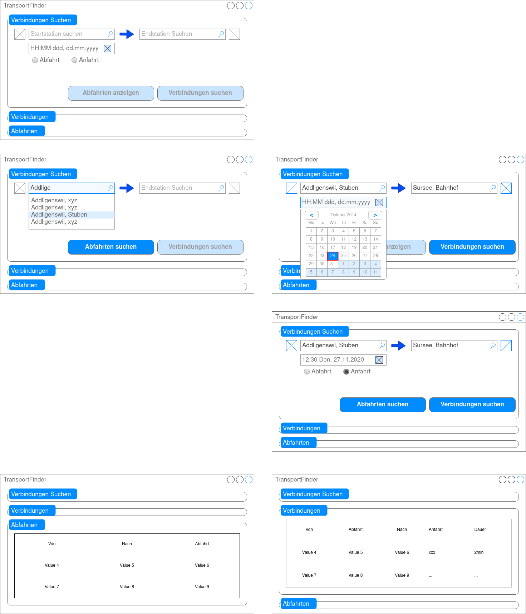

# modul-318-Student: TransportFinder
By Aleksandra Kina for ÜK M318, 24.11-02.12.2020
Handed in on 02.12.2020

# Dokumentation
## Inhalt
1. Einleitung
2. Zweck der Dokumentation
3. Vorgehen
4. Mockups
5. User Stories
6. Aktivitätsdiagramm
7. Testfälle
8. Testprotokoll
9. Installationseinleitung   
10. Weiteres

## Einleitung
Während der ÜK 318-1 "Analysieren und objektbasiert programmieren" haben wir als Auftrag bekommen, 
eine Applikation in Stil von SBB Verbindung-Suche zu selber planen, umsezten, testen, und dokumentieren.
Die App bietet Funktionen wie Verbindungen anhand von Start- und Endpunkt, Datum und Zeit suchen, Abfahrtstafel 
einer Station anzeigen, oder Stationen auf Karte anzeigen.

## Zweck der Dokumentation
Dieser Dokument dient dazu, der Verlauf der Entwicklung, Architektur der Applikation,
 sowie Installationsverfahren und Nutzung, in Art von Benutzerhandbuch, zu dokumentieren.
(also es zählt 40% zu der Bewertung)

## Vorgehen

## Mockup

## User Stories
| ID    | Titel                 | Beschreibung                                                                                                     | Abnahmekriterium                                                                                                                          | Priorität | Status          |
| ----- | --------------------- | ---------------------------------------------------------------------------------------------------------------- | ----------------------------------------------------------------------------------------------------------------------------------------- | --------- | --------------- |
| TRF-1 | Stationen Eingeben    | Ich als User will das ich eine Station eingeben kann um Verbindungen zu finden.                                  | -Abfahrtsstationsinputfeld ist vorhanden-Endstationsinputfeld ist vorhanden                                                               | 1         | Fertig          | 
| TRF-2 | Verbindungen Finden   | Ich als User will das mir die Verbindungen zwischen zwei Stationen angezeigt werde.                              | -Wen die beiden Stationen eingegeben werden und ein Button geklickt wird werden die Verbindungen angezeigt                                | 1         | Fertig          |
| TRF-3 | Abfahrten Finden      | Ich als User will eine Abfahrtsstation eingeben können und alle Abfahrten dieser Station sehen.                  | -Wen das Abfahrtsstationsinputfeld nicht leer ist und ein Button gedrückt wird werden die Abfahrten der Eingegebenen Stationen angezeigt. | 1         | Fertig          |
| TRF-4 | Stationen Vorschlagen | Ich als User will wen ich eine Station eingebe das mir Vorschläge gemacht werden                                 | -Nach drei Buchstaben kommen die Vorschläge danach.                                                                                       | 2         | Fertig          |
| TRF-5 | Zeit und Datum        | Ich als User will Datum und Uhrzeit angeben können und mir die Verbindungen zu diesem Zeitpunkt angezeigt werden | -Datum und Zeit Inputfeld ist vorhanden-Für dies werden dann die gewünschten Verbindungen angezeigt                                       | 2         | Fertig          |
| TRF-6 | Mein Standort         | Ich als User will Verbindungen von meinem Standort angezeigt bekommen                                            | -Dem User werden die Verbindungen von Stationen in seiner nähe angezeigt.                                                                 | 3         | Nicht umgesetzt |
| TRF-7 | Stationen auf Karte   | Ich als User will die eingegebene Station auf der Karte sehen können.                                            | -Karte kann geöffnet werden-Auf der Karte ist die gewählte Station zu sehen.(Abfahrtsstation)                                             | 3         | Fertig          |
| TRF-8 | Verbindungen per Mail | Ich als User will Informationen zu einer Verbindung einem Kollegen per Mail senden können.                       | -Email Entwurf öffnet sich.-Verbindungsinformationen befinden sich im Inhalt                                                              | 3         | Nicht umgesetzt |
| TRF-9 | DarkMode              | Ich als User will die Applikation im DarkMode anzeigen können.                                                   | -Das Ui kann per Button Click in den DarkMode geändert werden.                                                                            | 3         | Nicht umgesetzt |

## Aktivitätsdiagramm
## Testfälle
## Testprotokoll
## Weiteres
## Installationseinleitung
## Weiteres
