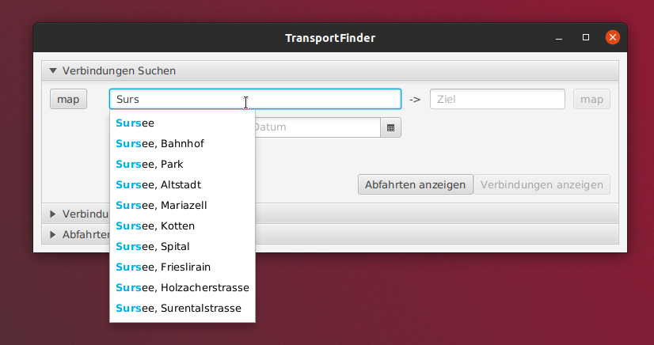

# modul-318-Student: TransportFinder

By Aleksandra Kina for ÜK M318, 24.11-02.12.2020 Handed in on 02.12.2020.

# Dokumentation

## Inhalt

1. Einleitung
2. Zweck der Dokumentation
3. Vorgehen
4. Mockups
5. User Stories
6. Testfall/Use Case
7. Testprotokoll
8. Installationseinleitung
9. Weiteres

## Einleitung

Während der ÜK 318-1 "Analysieren und objektbasiert programmieren" haben wir als Auftrag bekommen, eine Applikation in
Stil von SBB Verbindung-Suche zu selber planen, umsezten, testen, und dokumentieren. Die App bietet Funktionen wie
Verbindungen anhand von Start- und Endpunkt, Datum und Zeit suchen, Abfahrtstafel einer Station anzeigen, oder Stationen
auf Karte anzeigen.

## Zweck der Dokumentation

Dieser Dokument dient dazu, der Verlauf der Entwicklung, Architektur der Applikation, sowie Installationsverfahren und
Nutzung, in Art von Benutzerhandbuch, zu dokumentieren.
(also es zählt 40% zu der Bewertung)

## Mockup

## User Stories

| ID    | Titel                 | Beschreibung                                                                                                     | Abnahmekriterium                                                                                                                          | Priorität | Status          |
| ----- | --------------------- | ---------------------------------------------------------------------------------------------------------------- | ----------------------------------------------------------------------------------------------------------------------------------------- | --------- | --------------- |
| TRF-1 | Stationen Eingeben    | Ich als User will das ich eine Station eingeben kann um Verbindungen zu finden.                                  | -Abfahrtsstationsinputfeld ist vorhanden-Endstationsinputfeld ist vorhanden                                                               | 1         | Fertig          | 
| TRF-2 | Verbindungen Finden   | Ich als User will das mir die Verbindungen zwischen zwei Stationen angezeigt werde.                              | -Wen die beiden Stationen eingegeben werden und ein Button geklickt wird werden die Verbindungen angezeigt                                | 1         | Fertig          |
| TRF-3 | Abfahrten Finden      | Ich als User will eine Abfahrtsstation eingeben können und alle Abfahrten dieser Station sehen.                  | -Wen das Abfahrtsstationsinputfeld nicht leer ist und ein Button gedrückt wird werden die Abfahrten der Eingegebenen Stationen angezeigt. | 1         | Fertig          |
| TRF-4 | Stationen Vorschlagen | Ich als User will wen ich eine Station eingebe das mir Vorschläge gemacht werden                                 | -Nach drei Buchstaben kommen die Vorschläge danach.                                                                                       | 2         | Fertig          |
| TRF-5 | Zeit und Datum        | Ich als User will Datum und Uhrzeit angeben können und mir die Verbindungen zu diesem Zeitpunkt angezeigt werden | -Datum und Zeit Inputfeld ist vorhanden-Für dies werden dann die gewünschten Verbindungen angezeigt                                       | 2         | Fertig          |
| TRF-6 | Mein Standort         | Ich als User will Verbindungen von meinem Standort angezeigt bekommen                                            | -Dem User werden die Verbindungen von Stationen in seiner nähe angezeigt.                                                                 | 3         | Nicht umgesetzt |
| TRF-7 | Stationen auf Karte   | Ich als User will die eingegebene Station auf der Karte sehen können.                                            | -Karte kann geöffnet werden-Auf der Karte ist die gewählte Station zu sehen.(Abfahrtsstation)                                             | 3         | Fertig          |
| TRF-8 | Verbindungen per Mail | Ich als User will Informationen zu einer Verbindung einem Kollegen per Mail senden können.                       | -Email Entwurf öffnet sich.-Verbindungsinformationen befinden sich im Inhalt                                                              | 3         | Nicht umgesetzt |
| TRF-9 | DarkMode              | Ich als User will die Applikation im DarkMode anzeigen können.                                                   | -Das Ui kann per Button Click in den DarkMode geändert werden.                                                                            | 3         | Nicht umgesetzt |
Geschrieben von: Aleksandra und Fabian

Stories TRF-6, TRF-8 und TRF-9 würden wegen Zeitdruck und/oder Softwarelimitationen nicht umgesetzt.

## Testfall/Use Case

1. Programm starten (siehe [Installations- und Starteinleitung](#installations--und-starteinleitung))
2. Nach Startort suchen (zB. "Surs" eingeben) => Resultäte wie "Sursee" und "Sursee, Bahnof" erscheinen.
3. Eine Station aus der Liste auswählen.
   
4. Auf "map" drücken, um die Station auf einer Karte zu anzeigen => Ein Fenster erscheint mit dem Standort auf einer
   Karte.
   
5. Auf "Abfahrten anzeigen" drücken => Fach "Abfahrten" öffnet sich Startort, Zielort und Abfahrtszeit.
   
6. Zur Fach "Verbindungen suchen" zurückkehren.
7. Zielort eingeben.
8. Zeit, Datum und Abfahrt/Anfahrt auswählen.
   
9. Auf "Verbindungen anzeigen" drücken => Fach "Verbindungen" öffnet sich mit den Daten, die den Eingegebenen
   entsprechen,
   

## Testprotokoll

02.12.2020, durchgeführt von Aleksandra Kina auf Windows 10

| Schrittnummer | OK  | Wenn NOK, Abweichung von Erwartungen |
| ------------- | --- | ------------------------------------ |
| 1             | OK  | -                                    |
| 2             | OK  | -                                    |
| 3             | OK  | -                                    |
| 4             | OK  | -                                    |
| 5             | OK  | -                                    |
| 6             | OK  | -                                    |
| 7             | OK  | -                                    |
| 8             | OK  | -                                    |
| 9             | OK  | -                                    |

## Installations- und Starteinleitung

Voraussetzung: Java 14 installliert mit JAVA_HOME eingerichtet
(wird by default nicht gemacht, also gut achten bei Installation!)
[Installationsdatei](https://github.com/AdoptOpenJDK/openjdk14-binaries/releases/download/jdk-14.0.2%2B12/OpenJDK14U-jre_x64_windows_hotspot_14.0.2_12.msi)

1. [Applikation .zip](https://github.com/alex-skxy/modul-318-student/blob/master/modul-318-student_TransportFinder.zip)
   herunterladen
2. Extrahieren
3. Ordner öffnen und ins "bin" Ordner navigieren
4. modul-318-student.bat Datei ausführen

Zum deinstallieren einfach den Ordner löschen.

## Weitere Infos

### Warum Java?
Wegen meinen Preferenzen. Erstens, ich kenne Java besser als C#. Gleich ist es mit der Entwicklungsumgebung. Zweitens,
JavaFX gibt die möglichkeit UIs mit XML zu designen, was mir viel lieber ist als in Visual Studio tausend mal
herumklicken, nur um das Text von einen Label zu ändern.. Drittens, Pfatform/Entwicklungsumgebung. Ich schaffe lieber
mit Linux als Windows, und Java bietet bessere Platformunabhängigkeit. So kann ich auf Linux entwickeln und testen und
noch immer Sicherheit haben, dass es auf Linux noch funktioniert.

Aber mit meiner Kentnissen war der Projekt noch immer ein Challenge. Es fehlte mir oft am Dokumentationen, Beispielen
und Lernressourcen. Ich könnte nicht Wissen mit meinen ÜK-Kollegen teilen, weil alle andere es mit C# gemacht haben.
Glücklicherweise habe ich [ein Projekt](https://github.com/SirCremefresh/m318-project-zugfuehrer) gefunden, dass ich als
Vorlage nutzen konnte.

### Coding Guidelines
Ich habe mich hauptsächlich and der Standard Java-Namenkonvention gehaltet: Klassen grosss, Methoden, Member, und
Variablen in camelCase, etc etc. ...

Es gibt aber ein Paar Sachen, die ich bewusst anders mache, indem:
1. "var" über Typendeklaration überall wo möglich. Ich finde das "var" sehr hilft, um die Standard-Verbosigkeit von Java
   zu vermeiden.
2. public final Members über private Members mit Getters/Setters. Nach meiner Meinung führt private mit Getters/Setters 
zu sinnlosen Boilerplate Code, sowie unnötigen Verbosigkeit. Lombok @Data Annotationen helfen es zu vermeiden, 
   die Getters und Setters zu schreiben, aber connection.to sieht noch immer besser als connection.getTo().
   An vielen Orten gibt es aber die @Data Annotationen sowieso, weil Frameworks wie JavaFX erwarten es, dass die
   Klassen mehr oder weniger Bean-Konform sind.
   
### Bekannte Fehler und Issues
1. AutoComplete ist einbisschen mühsam zum nutze, es gibt immer wieder Verzögerung. Dass passiert wegen API Calls 
   im Hintergrund.
2. AutoComplete Keyboard Navigation funktioniert nur wenn man von Anfang an Keyboard nutzt. Wenn man mit Maus auf Feld
 klickt und dann probiert sich mit Keyboard zu bewege, funktioniert es nicht.